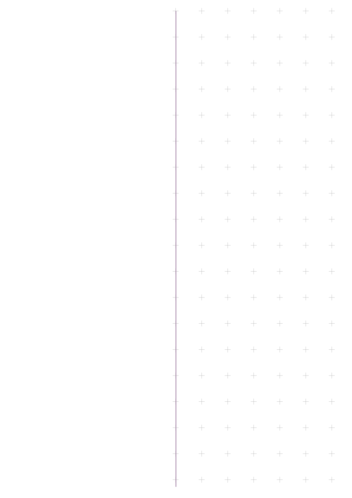
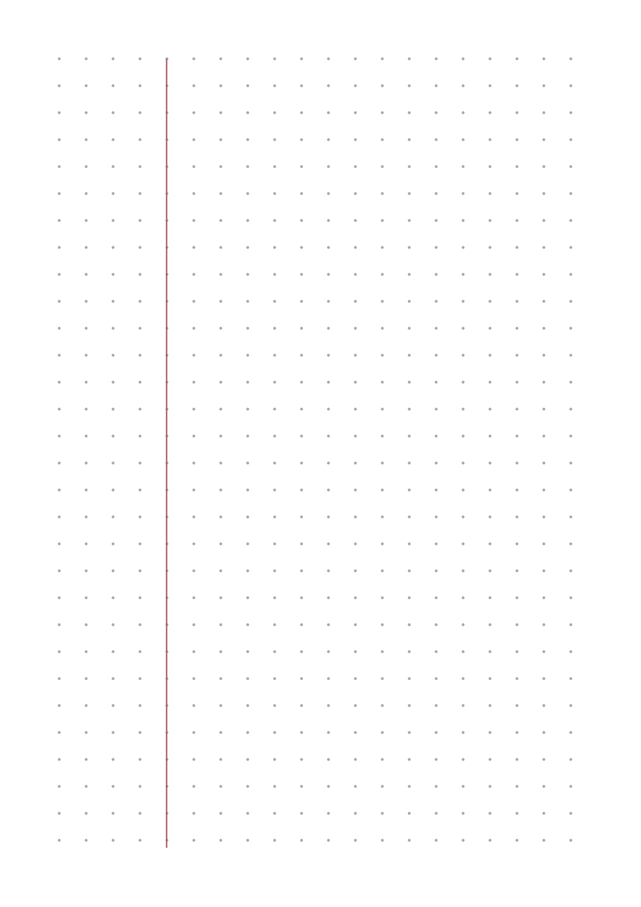
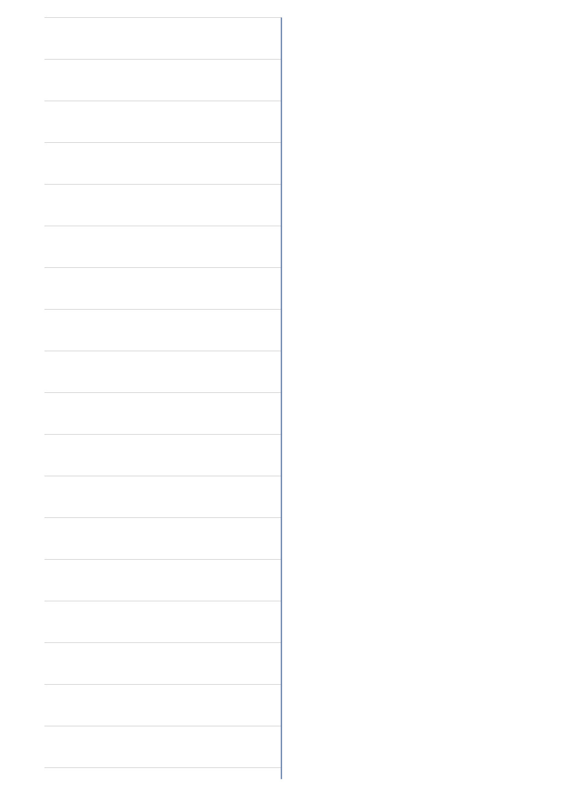
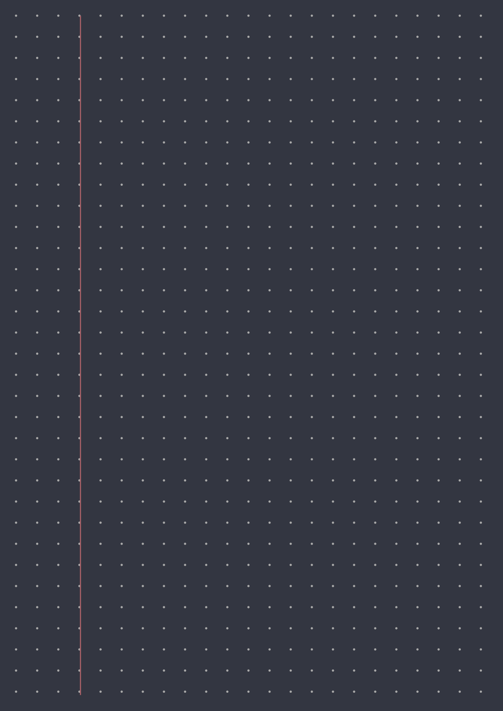

# Paper Template Generator

With this template generator you can create your own paper style for your (digital) notebooks.
It's easy to use and you can use your paper styles in any notebook app that supports PDF import.

Please notice, it's still WIP, so if you miss some functionality, there is a chance it will be implemented soon.

## Some examples

## Roadmap

- [ ] More options
  - [ ] Guide line width
  - [ ] Line/Grid stroke width
  - [ ] Major/minor coloring
- [ ] More templates
  - [ ] Hexagonal
  - [ ] Polar chart
- [ ] Headers
- [ ] Code style (reduce boilerplate)
- [ ] Config import
- [ ] Bug fixes
